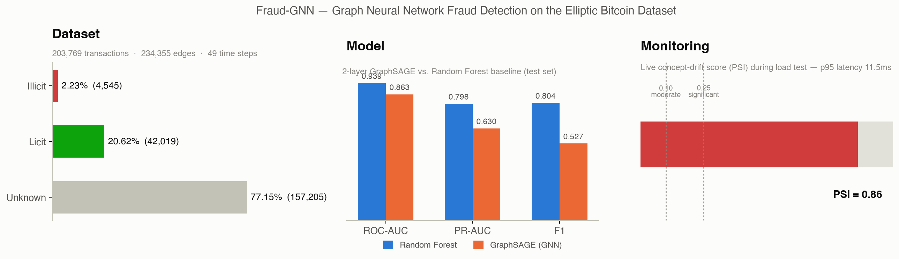

# Fraud-GNN — Graph Neural Network Fraud Detection on the Elliptic Bitcoin Dataset

<p align="center">
  
</p>

A complete, end-to-end system for detecting illicit Bitcoin transactions: exploratory analysis of the
public Elliptic dataset, a Graph Neural Network trained on the resulting transaction graph, and a
containerised, real-time inference service instrumented with production-style monitoring
(system health, model performance, and concept-drift detection).

---

## 1. Overview

**Elevator summary:** this repository trains a 2-layer GraphSAGE Graph Neural Network on the
Elliptic Bitcoin transaction graph (203,769 nodes, 234,355 edges) to classify transactions as
illicit or licit, and serves the resulting model behind a FastAPI endpoint backed by a Redis
feature/adjacency store, with Prometheus + Grafana monitoring across three layers: system health,
model performance, and concept drift.

The project is organised in two phases:

- **Phase 1 — Exploratory Data Analysis.** Statistical and graph-theoretic analysis of the Elliptic
  dataset (`notebooks/01_eda.ipynb`), producing the risk signals and design constraints that drove
  Phase 2's architecture.
- **Phase 2 — Implementation.** A full build, from data pipeline through a containerised, monitored,
  real-time service, executed as 12 discrete stages, each with binding, tested acceptance criteria.

**Intended audience:** this document assumes general familiarity with cryptocurrency, fraud
detection, and machine learning, and is written to be readable without prior graph neural network
experience — non-technical explanations accompany the technical ones throughout rather than
replacing them. No separate document is required to evaluate the project's methodology or results.

### Key metrics at a glance

| Metric | Value |
|---|---|
| Transactions (nodes) | 203,769 |
| Payment edges | 234,355 |
| Time steps | 49 |
| Labelled fraction | 22.85% (4,545 illicit / 42,019 licit) |
| Illicit share of labelled data | 9.76% |
| GNN architecture | 2-layer GraphSAGE, hidden dim 128, mean aggregation |
| Baseline model | Random Forest, 200 estimators |
| GNN test ROC-AUC / PR-AUC / F1 | 0.863 / 0.630 / 0.527 |
| Baseline test ROC-AUC / PR-AUC / F1 | 0.939 / 0.798 / 0.804 |
| Inference latency (p95, end-to-end HTTP) | 11.5 ms |
| Load test throughput | 5,000/5,000 requests succeeded, 0 errors |
| Automated test suite | 26 tests (data, model, drift, feature store, API) |
| Monitored containers | 4 (API, Redis, Prometheus, Grafana) |

---

## 2. Problem statement

Bitcoin transactions are pseudonymous: every payment is publicly recorded on-chain, but no identity
is directly attached to an address. This property is exploited for money laundering, ransomware
payouts, and dark-market commerce, where funds are routed through chains of transactions designed to
obscure origin. The practical task is binary classification: given a transaction and its position in
the payment graph, estimate the probability that it is illicit.

**Why graph structure is informative.** Modelling transactions independently discards information
carried by their connectivity. Representing the data as a directed graph — each transaction a node,
each payment an edge — allows a classifier to condition on a transaction's local neighbourhood, not
just its own feature vector. This is the basis for using a **Graph Neural Network (GNN)**: rather
than processing each node's features in isolation, a GNN performs *message passing*, aggregating
transformed representations from a node's neighbours at each layer, so a 2-layer network conditions
each prediction on up to a 2-hop neighbourhood. In non-technical terms, this is analogous to
assessing a person partly by their known associates rather than by their attributes alone. Whether
this structural signal outperforms a purely tabular model on this dataset is an empirical question
this project answers directly (§5).

---

## 3. Dataset

The [Elliptic Data Set](https://www.kaggle.com/datasets/ellipticco/elliptic-data-set) is a public
graph of real Bitcoin transactions released for anti-money-laundering research. It consists of three
components:

| File | Rows | Content |
|---|---|---|
| `elliptic_txs_features.csv` | 203,769 | `txId`, `time_step` (1–49), and 165 anonymised numerical features (93 local + 72 aggregated one-hop statistics) |
| `elliptic_txs_edgelist.csv` | 234,355 | `txId1 → txId2` directed payment edges |
| `elliptic_txs_classes.csv` | 203,769 | Label per `txId`: `1` = illicit, `2` = licit, `unknown` = unlabelled |

Features are pre-anonymised and standardised by the dataset publisher; their semantic meaning is not
disclosed, so all modelling is feature-agnostic by construction.

**Class distribution:**

| Class | Count | % of all nodes | % of labelled nodes |
|---|---|---|---|
| Illicit | 4,545 | 2.23% | 9.76% |
| Licit | 42,019 | 20.62% | 90.24% |
| Unknown | 157,205 | 77.15% | — |

Only 22.85% of nodes carry a ground-truth label; the remaining 77.15% are of unknown status. All
nodes — labelled and unlabelled — participate in message passing (a transductive setting), but only
labelled nodes contribute to the training loss.

**Graph topology:**

| Property | Value |
|---|---|
| Mean / median / max degree | 2.30 / 2 / 473 |
| Mean degree, illicit nodes | 2.01 (in 1.27, out 0.74) |
| Mean degree, licit nodes | 3.10 (in 1.91, out 1.19) |
| Edges crossing time steps | 0.00% |
| Connected components | 49 (exactly one per time step) |
| Graph type | Directed acyclic graph (confirmed) |

The finding that 100% of edges are intra-time-step — the graph decomposes into 49 temporally
disjoint components — is structurally significant: it rules out cross-time information leakage and
motivates the temporal train/test split described in §5, since message passing cannot propagate
information across time steps by construction.

**Univariate feature separation** (Cohen's *d*, illicit vs. licit, ranked): `feat_53` (d=1.16),
`feat_55` (d=1.00), `feat_89` (d=0.99), `feat_90` (d=0.99), `feat_91` (d=0.76), `feat_52` (d=0.75).
These six features form the basis of the production concept-drift monitor (§6).

**Operational risk factors identified in Phase 1**, each of which directly shaped the Phase-2
architecture:

1. **Severe class imbalance combined with majority-unlabelled data** — 2.23% illicit overall, 77.15%
   unlabelled — rules out accuracy as an evaluation metric; PR-AUC and F1 are used throughout.
2. **Non-stationarity / concept drift.** Illicit-rate and model performance are not stable across
   time steps; per-time-step evaluation (§5) shows a sharp degradation after time step ≈43,
   consistent with a documented dark-market shutdown affecting the underlying transaction patterns.
3. **Deployment requirement.** A static model has no operational value without continuous
   performance and drift monitoring — the system described in §6 exists specifically to detect the
   failure mode identified in this analysis.

---

## 4. System architecture

```
                         docker-compose (4 services, local orchestration)

 ┌──────────────┐   HTTP    ┌──────────────────────────┐   pipelined    ┌────────────┐
 │  client /    │ ────────▶ │   api (FastAPI+Uvicorn)   │ ─── lookup ──▶ │   redis    │
 │  load-gen    │ ◀──────── │   /score /health /metrics │ ◀────────────  │  feature + │
 └──────────────┘  response │   /feedback                │                │  adjacency │
                            │   GraphSAGE (PyTorch, CPU) │                │    store    │
                            └─────────────┬──────────────┘                └────────────┘
                                          │ scrape (5s interval)
                                ┌─────────▼─────────┐   query    ┌────────────┐
                                │     prometheus     │ ─────────▶ │  grafana   │
                                │  (metrics storage)  │            │ (4-panel   │
                                └────────────────────┘            │ dashboard) │
                                                                   └────────────┘
```

**Design principle: separation of the learned component from operational infrastructure.** The
GraphSAGE model is the only statistically learned element in the serving path. The API layer,
feature store, metrics pipeline, and dashboards constitute deterministic infrastructure whose
function is to deliver transactions to the model with low latency and to continuously verify that
the model's operating conditions still resemble its training distribution.

**Component inventory:**

| Component | Technology | Role |
|---|---|---|
| Inference API | FastAPI + Uvicorn | `/score`, `/health`, `/metrics`, `/feedback` |
| Feature/adjacency store | Redis 7 (alpine) | Per-transaction feature hashes (`feat:{txId}`) and neighbour sets (`nbr:{txId}`), pipelined batch access |
| Model | PyTorch 2.13 + PyTorch Geometric 2.8, GraphSAGE, CPU inference | Scores a transaction given its 1-hop induced subgraph |
| Metrics | prometheus-client + prometheus-fastapi-instrumentator | System-health metrics (free), plus custom Counters/Histograms/Gauges for model performance and drift |
| Dashboards | Grafana | Fully provisioned on startup — no manual configuration |
| Orchestration | docker-compose + Makefile | 4 services, single-command bring-up |

---

## 5. Methodology & results

### 5.1 Baseline model

A Random Forest (`scikit-learn`, 200 estimators, balanced class weights, `random_state=42`) was
trained on the same feature set to establish a tabular performance bar. Evaluated on a temporal
holdout (train: `time_step ≤ 34`, n=29,894 labelled; test: `time_step ≥ 35`, n=16,670 labelled):

| Metric | Value |
|---|---|
| ROC-AUC | 0.9391 |
| PR-AUC | 0.7976 |
| F1 (threshold 0.5) | 0.8039 |
| Precision | 0.9023 |
| Recall | 0.7248 |

### 5.2 GraphSAGE model

**Architecture:** `SAGEConv(165→128) → BatchNorm1d → ReLU → Dropout(0.3) → SAGEConv(128→128) →
BatchNorm1d → ReLU → Dropout(0.3) → Linear(128→2)`, mean-aggregation, trained with class-weighted
cross-entropy loss (`w_licit=0.566, w_illicit=4.317`) and Adam (`lr=5e-3, weight_decay=5e-4`),
full-batch, up to 300 epochs with early stopping (patience=30) on validation PR-AUC.

**Training determinism.** Training runs on CPU. Empirically, PyTorch's MPS backend produced
non-deterministic results for this architecture — identical seed and configuration yielded
validation PR-AUC ranging from 0.67 to 0.98 across repeated runs (traced to non-deterministic
scatter-reduce behaviour in `SAGEConv` on Apple Silicon's MPS backend). CPU training is bit-for-bit
reproducible (two independent runs: `best_val_pr_auc=0.9797`, `best_epoch=137`, identical to four
decimal places) and completes in approximately two minutes for this graph size.

**Validation-set performance:** `best_val_pr_auc = 0.9797` at epoch 137; F1-optimal decision
threshold = 0.8555 (validation F1 = 0.9411 at that threshold).

**Test-set performance** (same temporal holdout as the baseline, n=16,670):

| Metric | @ threshold 0.5 | @ F1-optimal threshold (0.8555) |
|---|---|---|
| ROC-AUC | 0.8626 | 0.8626 |
| PR-AUC | 0.6297 | 0.6297 |
| F1 | 0.4193 | 0.5274 |
| Precision | 0.2931 | 0.4269 |
| Recall | 0.7359 | 0.6898 |

**Result: the GraphSAGE model does not exceed the Random Forest baseline on this evaluation** (PR-AUC
0.630 vs. 0.798; F1 0.527 vs. 0.804), despite comparable ROC-AUC (0.863 vs. 0.939). This is reported
as a primary empirical result of the project, not a defect to be minimised.

<details>
<summary><strong>Hyperparameter sweep and root-cause analysis (click to expand)</strong></summary>

Per the acceptance criteria defined for this stage, five of twelve permitted hyperparameter
combinations were evaluated (`HIDDEN ∈ {128,256}`, `DROPOUT ∈ {0.3,0.4,0.5}`, `LR ∈ {1e-3,5e-3}`, no
architectural changes permitted):

| Hidden | Dropout | LR | Val PR-AUC | Test PR-AUC | Test F1 | Test ROC-AUC | Test Precision @opt |
|---|---|---|---|---|---|---|---|
| 128 | 0.4 (initial default) | 5e-3 | 0.9828 | 0.5203 | 0.5341 | 0.8591 | 0.4578 |
| 128 | 0.5 | 1e-3 | 0.9808 | 0.2853 | 0.3893 | 0.8329 | 0.2677 |
| 128 | 0.5 | 5e-3 | 0.9816 | 0.4950 | 0.4881 | 0.8478 | 0.3891 |
| **128** | **0.3** | **5e-3** | **0.9797** | **0.6297 (shipped)** | **0.5274** | **0.8626** | **0.4269** |
| 256 | 0.3 | 5e-3 | 0.9801 | 0.5717 | 0.4806 | 0.8525 | 0.3680 |

Every configuration exhibits the same signature: validation PR-AUC saturates near 0.98 while test
PR-AUC remains in the 0.29–0.63 range, and precision collapses to 0.27–0.46 at any reasonable
decision threshold (vs. 0.90 for the baseline) despite acceptable ROC-AUC. This pattern is consistent
across hidden width, dropout, and learning rate, indicating the limitation is not resolvable by
hyperparameter tuning alone.

**Root cause.** `val_mask` is a random 15% stratified sample of the *training* period
(`time_step ≤ 34`), deliberately excluding the drift-affected region to avoid contaminating early
stopping with anomalous data. This choice has the unintended effect of selecting the checkpoint that
best predicts *stationary* conditions — the inverse of what generalises to the drift-affected test
region (`time_step ≥ 35`). The Random Forest baseline does not exhibit this failure mode, as it has
no validation-based model-selection step.

**Per-time-step test performance**, illustrating the degradation:

| Time step | n | n illicit | ROC-AUC | F1 |
|---|---|---|---|---|
| 35 | 1,341 | 182 | 0.9916 | 0.9003 |
| 38 | 756 | 111 | 0.9664 | 0.7510 |
| 42 | 2,154 | 239 | 0.9143 | 0.7209 |
| **43** | 1,370 | 24 | 0.5180 | 0.0111 |
| 44 | 1,591 | 24 | 0.5291 | 0.0274 |
| 47 | 846 | 22 | 0.5594 | 0.0303 |
| 49 | 476 | 56 | 0.3875 | 0.0194 |

The transition at time step 43 is abrupt across both the GraphSAGE model and the Random Forest
baseline, reproducing the concept-drift finding from Phase 1 (§3) in a live evaluation setting.

Two candidate remediations are identified and deferred to §8: a temporal validation split positioned
near the train/test boundary (directly targeting the diagnosed cause), and a residual connection from
raw input features to the output layer (preserving the strong univariate signal identified in §3
against dilution by neighbourhood averaging).

</details>

---

## 6. Real-time service & monitoring

### 6.1 Inference API

The service exposes two scoring modes via `POST /score`:

- **Known-transaction scoring** (`{"txId": ...}`) — retrieves the transaction's 1-hop induced
  subgraph from the Redis feature store and performs a forward pass.
- **Inductive scoring** (`{"features": [...165 values...], "neighbor_features": [[...], ...]}`) —
  constructs a star subgraph from supplied feature vectors, enabling scoring of transactions absent
  from the store (GraphSAGE's inductive capability).

`GET /health` reports service status and model version; `GET /metrics` exposes a Prometheus
exposition endpoint; `POST /feedback` accepts ground-truth labels for previously scored transactions
and updates rolling precision/recall/F1 gauges.

### 6.2 Feature store

Redis holds two structures per transaction: a hash of its 165 features (`feat:{txId}`) and a set of
its neighbour transaction IDs (`nbr:{txId}`) — 407,538 keys total (2 × 203,769 nodes, confirming zero
isolated nodes in the graph). Subgraph retrieval is pipelined — one round trip per BFS layer for
neighbour lookups, one round trip for all feature lookups — rather than one round trip per node. This
reduced retrieval latency for the highest-degree node in the graph (473 neighbours) from
approximately 475 ms (naive, one round trip per neighbour) to approximately 141 ms; over a random
sample of 200 transactions representative of the graph's mean degree (2.3), retrieval latency is
p50=2.07 ms, p95=5.18 ms, max=36.37 ms.

### 6.3 Monitoring — three layers

| Layer | Metrics | Purpose |
|---|---|---|
| **System health** | Request rate, p50/p95/p99 latency, error rate, in-flight requests, process CPU/memory (via `prometheus-fastapi-instrumentator`, no custom instrumentation required) | Standard service-level observability |
| **Model performance** | `fraud_predictions_total{label}` (Counter), `fraud_score_histogram` (Histogram), `fraud_flagged_ratio` (Gauge, rolling last 1,000 predictions), `fraud_rolling_precision/recall/f1` (Gauges, updated via `/feedback`) | Tracks prediction volume, score distribution, and — where ground truth is available — live accuracy |
| **Concept drift** | `fraud_drift_psi` (Gauge) | Detects distributional shift in live traffic relative to the training distribution |

**Concept-drift detection (technical detail).** The drift monitor maintains a sliding buffer of the
1,000 most recent observations and recomputes, every 200 new observations, the Population Stability
Index (PSI) for each of the six highest-separation features identified in §3, against a 10-bin
reference distribution derived from the training set. `drift_score` is the mean PSI across these six
features. Thresholds: PSI < 0.10 (stable), 0.10–0.25 (moderate — logged as a warning), > 0.25
(significant — alert). In plain terms: this continuously checks whether current traffic still
resembles the data the model was trained on, and raises a signal well before accuracy would visibly
degrade.

**End-to-end verification.** A load test of 5,000 requests (mixed known-transaction and inductive
scoring, the final 30% deliberately drawn from post-time-step-43 transactions to induce drift) against
the fully containerised stack produced:

| Metric | Value |
|---|---|
| Requests succeeded / failed | 5,000 / 0 |
| Mean latency | 7.38 ms |
| p50 latency | 6.10 ms |
| p95 latency | 11.49 ms |
| p99 latency | 16.63 ms |
| Max latency | 164.23 ms |
| `fraud_drift_psi` during drift-inducing phase | 0.86 (exceeds the 0.25 "significant" threshold) |

The drift gauge crossing its alert threshold during the deliberately drift-inducing phase of this
test confirms the monitor detects, live, the exact failure mode identified analytically in §3 and §5.

---

## 7. Quickstart

```bash
make setup                    # uv sync — install the Python environment
make train                    # train GraphSAGE (deterministic on CPU, ≈2 minutes)
make eval                     # print final test-set metrics and the per-time-step table

make up                       # docker compose up --build -d — starts all 4 services
make seed                     # load the transaction graph into Redis
make loadgen                  # issue 5,000 test requests; reports latency percentiles

make down                     # stop and remove all containers
```

| Endpoint | URL | Description |
|---|---|---|
| API (interactive docs) | `http://localhost:8000/docs` | OpenAPI/Swagger UI for `/score`, `/health`, `/metrics`, `/feedback` |
| Prometheus | `http://localhost:9090` | Raw metrics and query interface |
| Grafana | `http://localhost:3000` | Provisioned dashboard, no login required |

**Grafana dashboard layout** (`Fraud-GNN Monitoring`, provisioned automatically): four rows —
*System Health* (request rate, latency, CPU/memory), *Prediction Volume & Score Distribution*
(prediction rate by label, score histogram, flagged-ratio gauge), *Concept Drift* (`fraud_drift_psi`
with 0.10/0.25 threshold lines), and *Model Performance* (rolling precision/recall/F1, populated once
`/feedback` receives ground-truth labels). Running `make loadgen` while the dashboard is open drives
all four rows live, including the Concept Drift panel crossing its alert threshold during the load
generator's drift-inducing phase.

To run only the Phase-1 analysis:

```bash
uv sync
uv run jupyter lab notebooks/01_eda.ipynb
```

---

## 8. Future work

The following items are scoped, diagnosed where applicable, and deliberately deferred rather than
implemented in this iteration:

| Item | Rationale | Expected impact |
|---|---|---|
| Temporal validation split (last few pre-test time steps, replacing the random 15% split) | Directly targets the root cause identified in §5.2 — early stopping currently selects for stationary-period performance | Primary candidate for closing the PR-AUC/F1 gap to the baseline |
| Residual connection from raw features to the output layer | Preserves the strong univariate signal identified in §3 against dilution from neighbourhood averaging, particularly for low-degree (illicit) nodes | Secondary candidate, complementary to the above |
| Complete remaining hyperparameter sweep (7 of 12 combinations untested) | Low priority — the observed precision-collapse pattern is consistent across all five tested combinations, suggesting tuning alone is insufficient | Low expected impact in isolation |
| Re-enable MPS training | PyTorch's MPS backend produced non-deterministic `SAGEConv` results on this hardware/version combination; revisit on a future PyTorch release | Training-speed improvement only; no accuracy impact expected |
| Reduce container image size | The serving image currently bundles analysis-only dependencies (Jupyter, matplotlib) not required at inference time; splitting dependency groups and/or using a CPU-only PyTorch wheel index would reduce build time and image size | Operational efficiency, no functional change |

---

## 9. Repository structure

```
fraud-gnn/
├── README.md                  # this document
├── LICENSE                    # MIT
├── docs/
│   ├── plan.md                 # full engineering build log: every stage, test, and measured result
│   └── followup.md             # tracked future-work and out-of-scope items
├── notebooks/
│   └── 01_eda.ipynb            # Phase-1 exploratory analysis
├── reports/                    # exported EDA figures and summary statistics
├── data/                       # Elliptic dataset (not committed; see §3 for source)
├── src/fraud_gnn/
│   ├── data.py                  # data loading, temporal/stratified masks, class weighting
│   ├── model.py                 # GraphSAGE definition
│   ├── train.py                 # training loop and artefact export
│   ├── evaluate.py               # test-set and per-time-step evaluation
│   ├── baseline.py               # Random Forest baseline
│   ├── featurestore.py           # Redis feature/adjacency store client
│   ├── drift.py                  # PSI concept-drift monitor
│   └── serve/                    # FastAPI application (/score, /health, /metrics, /feedback)
├── scripts/                    # Redis loader, load-test generator
├── tests/                      # automated test suite (26 tests; pytest)
├── docker/                     # API Dockerfile, Prometheus config, Grafana provisioning
├── docker-compose.yml          # 4-service orchestration
├── Makefile                    # commands listed in §7
└── pyproject.toml              # Python dependencies (uv-managed)
```

---

## 10. License & attribution

- **Dataset:** [Elliptic Data Set](https://www.kaggle.com/datasets/ellipticco/elliptic-data-set),
  released by Elliptic and collaborators for anti-money-laundering research on Bitcoin.
- **Code license:** MIT — see [`LICENSE`](LICENSE).
- This is an independent case-study project and is not affiliated with or endorsed by Elliptic.
